### Unboxing Docker Desktop

Time to Complete: 15-30 minutes

### How to Use This Hands-On Lab
1. You have installed the latest version of Docker Desktop.
2. You have installed a Git client.
3. You have an IDE or a text editor to edit files. Docker recommends using Visual Studio Code.
4. Clone the getting-started-app repository using the following command:
```sh
$ git clone https://github.com/artofthepossible/whale-of-a-time
```

Here's a guided tour of Docker Desktop based on the provided knowledge sources:</br>

Docker Desktop is an all-in-one application for Mac, Linux, or Windows that allows you to build, share, and run containerized applications and microservices. </br>
It provides a user-friendly graphical interface for managing containers, applications, and images directly from your machine.</br>

**New Docker Commands**
You can interact with docker desktop via the cli with these new commands

```sh
$ docker desktop start
✓ Starting Docker Desktop

$ docker desktop stop
✓ Stopping Docker Desktop

$ docker desktop restart
✓ Starting Docker Desktop

$ docker desktop status
✓ Check status

```
When you open Docker Desktop, you'll see the Docker Desktop Dashboard, which offers several key views:</br>

**Containers view**
```sh
This provides a runtime view of all your containers and applications.
You can interact with containers, manage their lifecycle, and perform common actions.
```
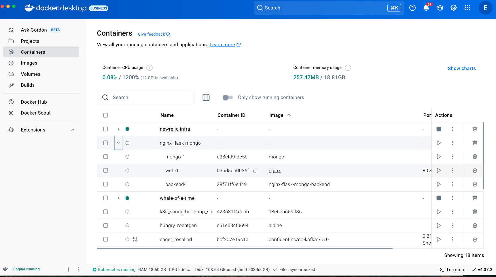

When a user selects an individula container in Docker Desktop, they can access detailed information like logs, low level details via inspect, you can exec into the container via docker debug, browse the file system and review stats.

**Logs**: View and search through the container's logs, copy log entries, and clear the log terminal.

**Inspect: Access** low-level details about the container, such as the local path, image version, SHA-256, and port mappings.

**Bind mounts**: Explore and manage bind mounts associated with the container.

**Exec**: Use the integrated terminal to run commands within the container, which is useful for debugging or understanding the container's current state.

**Files**: Browse the container's filesystem, edit files, drag and drop files between the host and container, and download files to the host.

**Stats**: Monitor the container's resource usage, including CPU, memory, network, and disk space over time.

**Docker Debug**
You can enable Docker Debug to execute commands, run the container.
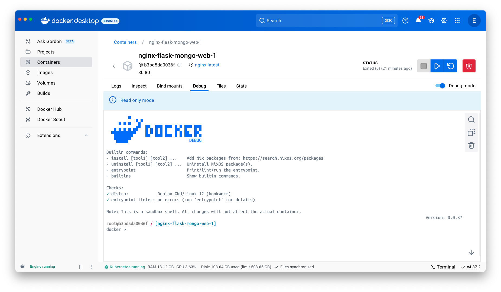

```sh
For our sample application with a flask frontend and mongo backend defined as servicees in the compose.yaml file, we can, we can view configurations via the compose file viewer.</br>
We can use docker compose up -d to start the entire application

```
**compose file viewer**
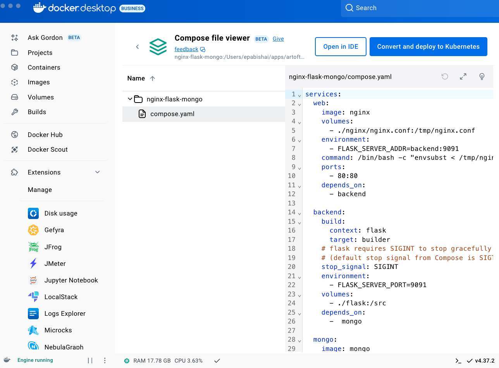

**Images view**: 
```sh
Here you can see a list of your Docker images, run images as containers, pull the latest versions from Docker Hub, and inspect images.
It also shows image vulnerabilities and clean-up options.
You can explore the image hierarch including the layers that make up your iamge
```
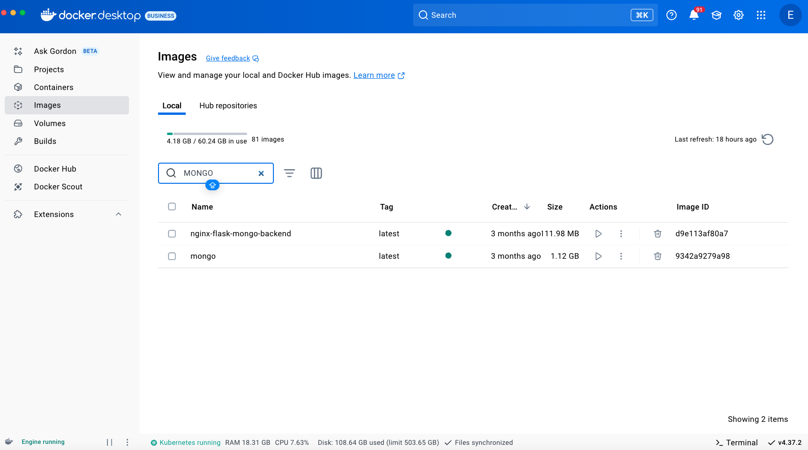

**Volumes view**: 
```sh
This displays a list of volumes and allows you to create, delete, and see which ones are being used.
Creates and manages Docker volumes on the host system. 
We can use volumes to mount data in the volume mount

We can use this along with compose watch to mount our code base and be able to view the changes locally
```
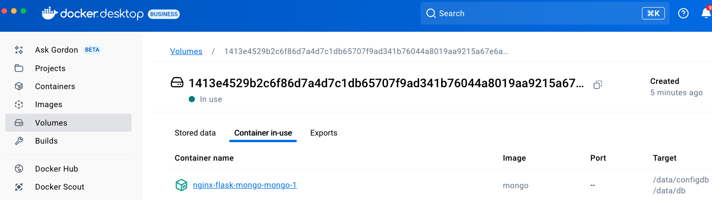

**Builds view**: 
```sh
You can inspect your build history and manage builders here.
```
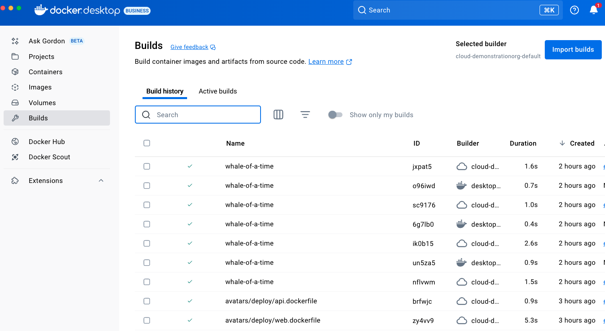
View build details: docker-desktop://dashboard/build/desktop-linux/desktop-linux/jx1vug9kxl9zmlazq96y355dp

Docker Build Cloud is a service that allows you to build your container images faster, both locally and in CI (Continuous Integration) environments. The builds run on cloud infrastructure that is optimally dimensioned for your workloads, with no configuration required. The service uses a remote build cache, ensuring fast builds anywhere and for all team members.

Within the info tab, you can view the build start and end time and Total build time</br>
You can view the tag and digest details</br>
You can get a sense of the cached and non cached steps</br>

Lets drill into the source tab, which shows you the docker file in use</br>
We can aslo look at the logs which helps you triage and log dive into the container build</br>
We can also glean the historical details of the builds for a specific image

The Dashboard also provides access to:</br>

**Settings menu** 
```sh
For configuring Docker Desktop
```
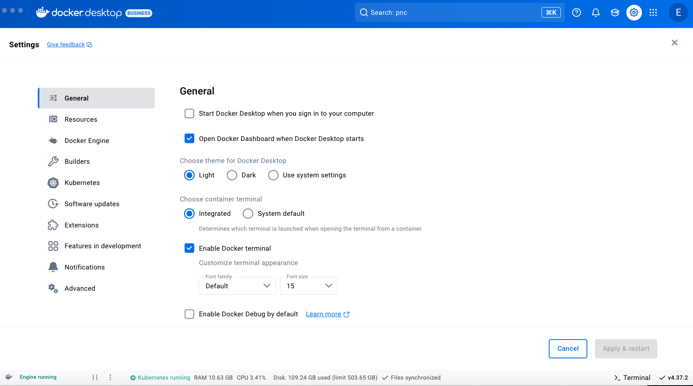

**Troubleshoot menu**
```sh
For debugging and performing restart operations
```
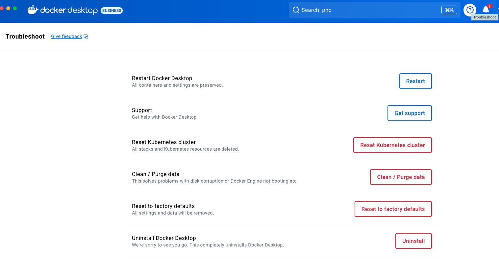

**Pro Tips Commands**
```sh
$ docker desktop start
✓ Starting Docker Desktop

$ docker desktop stop
✓ Stopping Docker Desktop

$ docker desktop restart
✓ Starting Docker Desktop

$ docker desktop status
✓ Check status

```

**Notifications center** 
```sh
For updates and other information
```
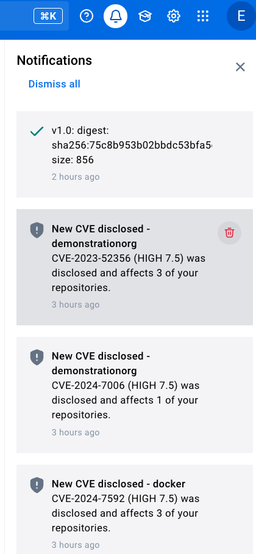

**Learning center** 
```sh
Quick in-app walkthroughs and resources
```
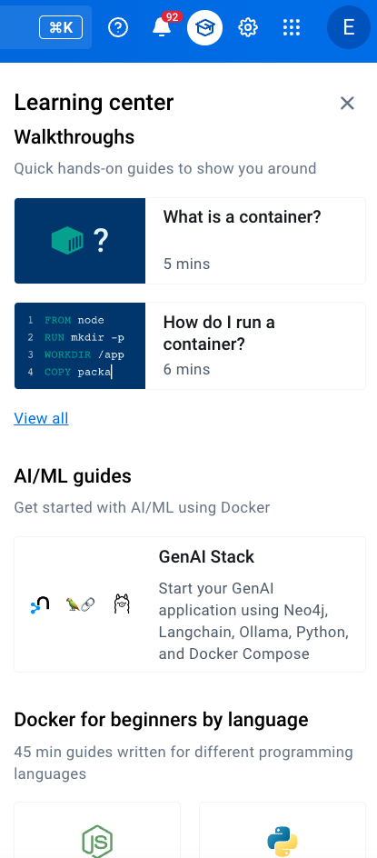

**Quick Search**
```sh
A key feature of Docker Desktop that is located in the Dashboard header.
This allows you to search for containers, images, extensions, volumes, and even Docker documentation.
```
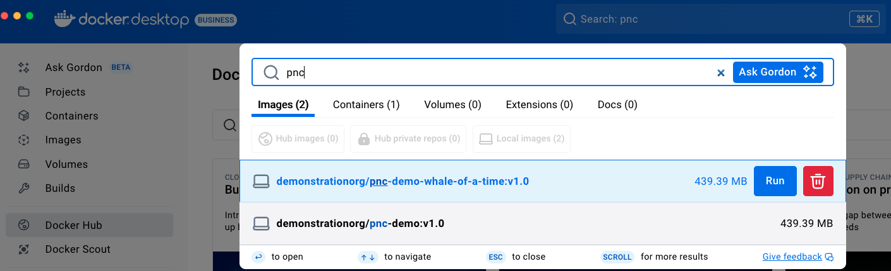

**Extensions**
```sh
Docker Extensions are a feature in Docker Desktop, to connect the common tasks and workflows that a developer work on
They extend the functionality of your common developer tools and help your developers to glean better insights, integration and automation when building containers
```
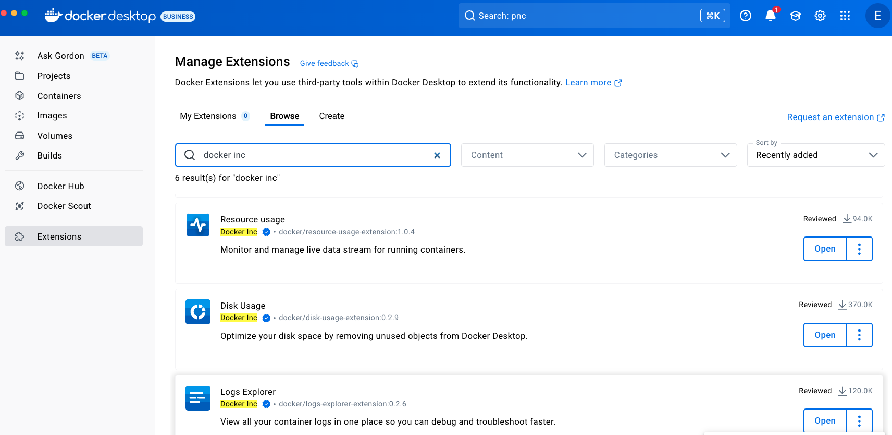


### Resources
[Docker Init](https://docs.docker.com/reference/cli/docker/init/)
[Containers View](https://docs.docker.com/desktop/use-desktop/container/)
[Images](https://docs.docker.com/desktop/use-desktop/images/)
[Volumes](https://docs.docker.com/desktop/use-desktop/volumes/)
[Builds](https://docs.docker.com/desktop/use-desktop/builds/)
